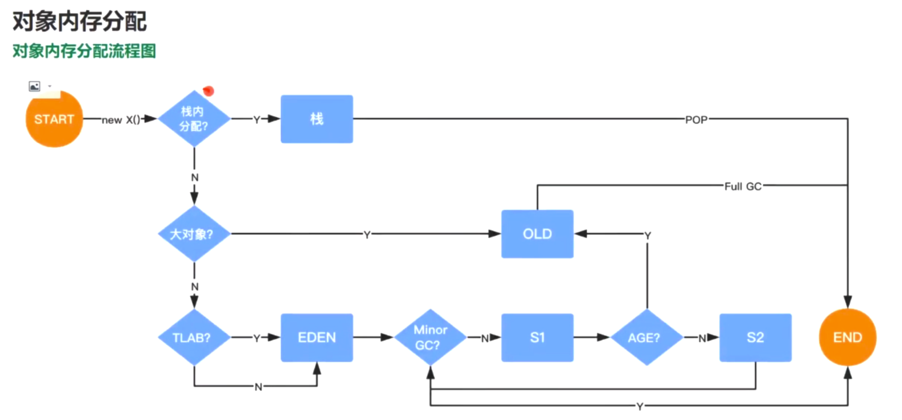

## 12.内存分配

对象内存分配：

1.栈上分配

- 开启逃逸分析 + 标量替换
- **编译器识别某个对象在一个方法内部不逃逸（不会返回出去），那么就会尝试将这个对象的内存分配在这个栈上，而不是放大堆中，这样可以达到有化的效果，随着方法执行完毕而销毁**；开启：-XX:+DoEscapeAnalysis；JDK7后默认开启了
- **标量替换：-XX:+EliminateAllocations**

  **如果栈上空间不够，则会尝试拆分 对象，直接使用属性 进行栈存储，标识属于这个对象。**

2.堆分配

- 大对象 - 直接方到 OLD区
  - 由-XX:PretenureSizeThreshold=1000000 (单位：字节)   + -XX:+UseSerialGC 控制
- 是否开启TLAB（本地预分配机制）
  - 都放入EDEN区